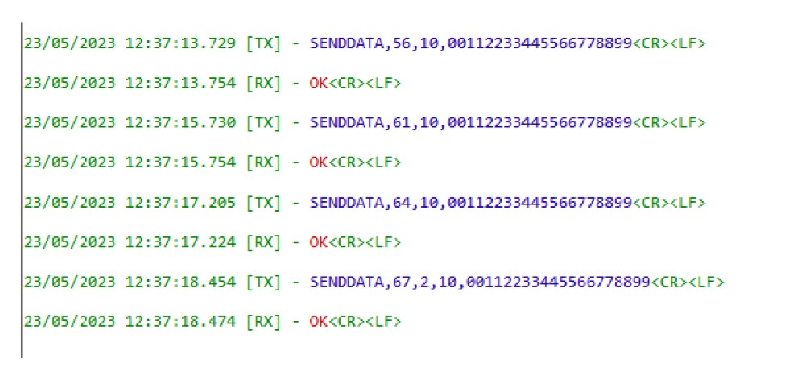
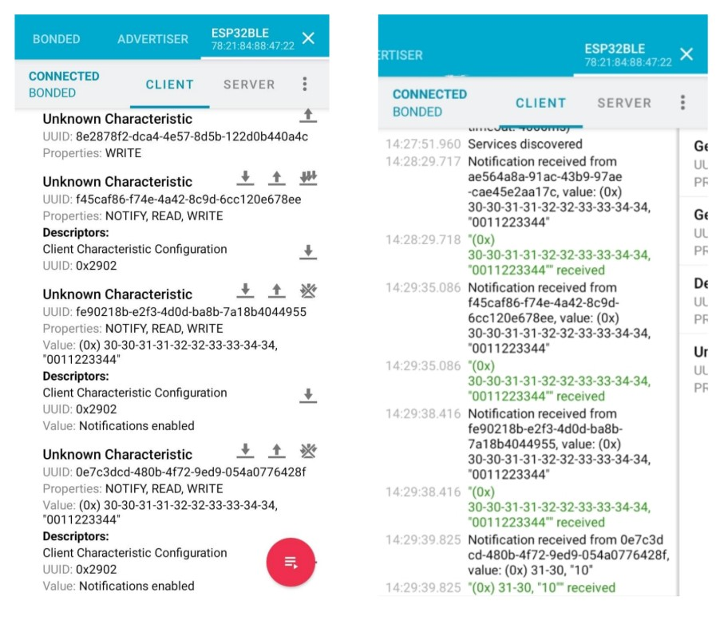

# ⚡ Optimized BLE to UART Communication with ESP32

Internship Project – Embedded Systems  
Innov Alliance Tech | Tunis, Tunisia | 02-2023 – 07-2023

---
- **Final Year Project Report**  
[Link to PDF report](ESP32_BLE_Report.pdf)  

---

## 🚀 Project Overview
The present report summarizes the work accomplished within the scope of the final year project aimed at obtaining a national Bachelor’s Degree in Computer Engineering, specializing in Embedded Systems and IoT, at the Faculty of Sciences of Tunis within Innov-Alliance-Tech.  

The main objective of this project was to establish **wireless connectivity for servomotors** used in the energy field (petrol, water, gas, nuclear). To achieve this, we developed an embedded program enabling:

- **Control of the servomotor**  
- **Data retrieval**  
- **Microcontroller updates**

This program provides **bidirectional communication** between the servomotor’s **Human-Machine Interface (HMI)** based on **STM32G474** and an **Android application**, utilizing both:

- **Wireless communication:** Bluetooth Low Energy (BLE)  
- **Serial communication:** Universal Asynchronous Receiver Transmitter (UART) via the ESP32 board  

Two methods were explored: one based on **AT commands** and the other utilizing **custom commands**.

**Keywords:** Bluetooth Low Energy, UART, GAP, GATT, SMP, Real-time system, ESP32, AT Commands, STM32

> **Note:** Source code cannot be published due to confidentiality agreements.

---

## 🛠️ Key Features
- **BLE to UART Bridge:** Connects the servomotor interface to Android via BLE.  
- **Optimized Data Transfer:** Reduced file transfer and data exchange time by 50%.  
- **Secure Communication:** Implemented data encryption for secure communication.  
- **Microcontroller:** ESP32 handles BLE and UART communication.  

---

## 🏁 Results

The system achieves optimal performance, meeting the following requirements:

- **Security:** Efficient pairing and encryption were implemented using **SMP**, along with secure transmission of passwords in the data, verified by the microcontroller.

- **Data Reliability:** Each frame includes a **CRC (Cyclic Redundancy Check)** to ensure correct reception of data.

- **Responsiveness:** The system provides a fast response time of **25 ms per command** and a file transfer time of **less than 10 minutes**.

- **Connectivity:** BLE communication operates without interference, ensuring **extended range** and a **stable connection**.

---

### 📷 System Demonstration

**1️⃣ Frames Sent by STM32 via UART and ESP32 Response**  

**2️⃣ Reception of Frames in the Android Application**  

## 📚 Useful Documentation

- **ESP32 Bluetooth Low Energy API**  
[https://docs.espressif.com/projects/esp-idf/en/stable/esp32/api-reference/bluetooth/bt_le.html](https://docs.espressif.com/projects/esp-idf/en/stable/esp32/api-reference/bluetooth/bt_le.html)

- **ESP32-AT User Guide**  
[https://docs.espressif.com/projects/esp-at/en/latest/esp32/index.html](https://docs.espressif.com/projects/esp-at/en/latest/esp32/index.html)

- **ESP32 UART (Universal Asynchronous Receiver/Transmitter)**  
[https://docs.espressif.com/projects/esp-idf/en/stable/esp32/api-reference/peripherals/uart.html](https://docs.espressif.com/projects/esp-idf/en/stable/esp32/api-reference/peripherals/uart.html)

- **Final Year Project Report**  
[Link to PDF report](ESP32_BLE_Report.pdf)  

